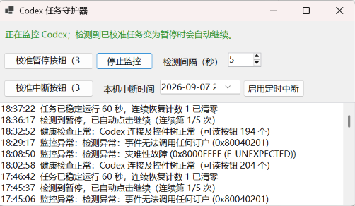

# Codex Task Keeper | Codex任务守护器
Codex任务守护器是一款Windows桌面工具，实时监控Codex任务状态:当任务意外暂停时（如遇到model is at capacity、Error running remote compact task等），程序会自动恢复运行，并支持定时中断、后台运行和连续失败保护，帮助用户无介入地、更稳定地运行长时间 Codex 任务。

  
   
  图：Codex Task Keeper 软件界面

